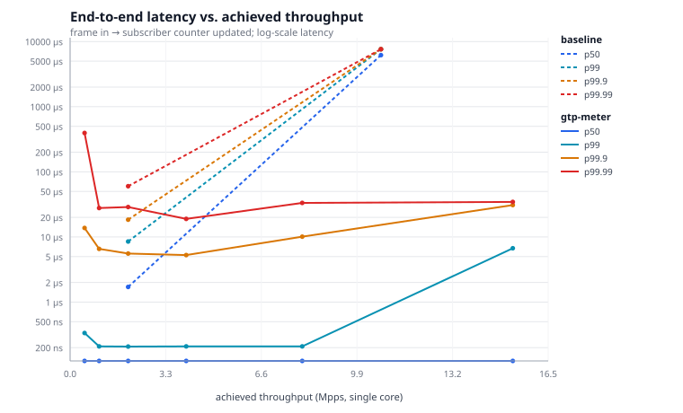

# gtp-meter — GTP-U / Diameter parser and line-rate metering pipeline

A mobile-core user-plane metering component in C++20: parse GTP-U on the N3/S1-U
interface and Diameter Gy charging traffic, attribute every byte to a subscriber
and a rating group, emit CDR-style usage records, and expose live counters —
with the tail latency measured rather than asserted.

This is the metering function of a UPF/SGW-U with PFCP left out. It is the same
shape of problem as an ITCH 5.0 market-data feed handler — fixed binary headers,
message-type dispatch, per-key state, a lock-free hand-off, a latency harness —
transplanted into a 4G/5G packet core. [The mapping is explicit](#relationship-to-market-data-feed-handling).

**Zero third-party dependencies.** No libpcap, no gtest, no HdrHistogram, no
Boost. A C++20 compiler, CMake, and (for the traffic generator) Python 3.

```
                ┌────────────────────────────────────────────────────────────┐
  NIC / pcap ──▶│ Ingest thread (pinnable)                                   │
                │   Ethernet/VLAN → outer IP/UDP → GTP-U → inner IP → 5-tuple│
                │   Diameter → AVP walk → Gy CCR/CCA                         │
                └───────┬──────────────────────────────┬─────────────────────┘
                        │ MeterEvent (64 B, 1 line)    │ GyEvent (control)
              lock-free SPSC ring                 low-rate SPSC ring
                        │                              │
                ┌───────▼──────────────────────────────▼─────────────────────┐
                │ Metering thread (pinnable) — owns all state, no locks      │
                │   TEID → binding      flat open-addressing hash            │
                │   Subscriber[]        64 B/subscriber, one cache line      │
                │   Flow table          5-tuple → stats, bounded LRU         │
                │   Usage records       deltas, gapless sequence numbers     │
                └───────┬──────────────────────────────┬─────────────────────┘
              seqlock snapshot                 usage-record ring
                        │                              │
                ┌───────▼──────────────────────────────▼─────────────────────┐
                │ Reporter thread — never blocks the data plane              │
                │   /metrics /stats /subscribers/{imsi} /flows /healthz      │
                │   usage-records.ndjson (append-only)                       │
                └────────────────────────────────────────────────────────────┘
```

---

## Quick start

```bash
cmake -S . -B build -DCMAKE_BUILD_TYPE=Release
cmake --build build -j
ctest --test-dir build --output-on-failure          # 18 test binaries

# Generate traffic: a capture, its session table, and the ground-truth totals.
python3 tools/gen_traffic.py --out traffic --packets 200000 --subscribers 500

# Meter it, write usage records, serve live counters.
./build/bin/gtp-meter \
    --pcap traffic.pcap \
    --sessions traffic-sessions.csv \
    --records usage-records.ndjson \
    --http 9109

curl -s localhost:9109/metrics | head -20
curl -s localhost:9109/subscribers/310150000000001 | python3 -m json.tool
```

`make help` lists the shortcuts (`make test`, `make bench`, `make asan`,
`make tsan`, `make fuzz`, `make golden`).

Live capture instead of replay (needs `CAP_NET_RAW`, or root on macOS):

```bash
sudo ./build/bin/gtp-meter --interface eth0 --sessions sessions.csv \
     --ingest-cpu 2 --meter-cpu 3 --busy-poll --http 9109
```

---

## Results

Measured on the hardware below with `bench/run_all.sh`. Raw output, including
the environment header each benchmark prints, is committed under
[bench/results/](bench/results/).

| | |
|---|---|
| CPU | Apple M5 (10 cores) |
| Compiler | Apple clang 21, `-O3 -mcpu=native` |
| OS | macOS 15 (Darwin 25.5) |
| Core isolation | **none** — see the caveat below |

> **Read the tails with that caveat in mind.** macOS offers affinity *hints*,
> not pinning; there is no `isolcpus` and no performance governor. Median and
> p99 figures here are stable across runs; p99.9 and beyond include scheduler
> noise and vary by an order of magnitude run to run. For publishable tail
> numbers, run this on isolated Linux cores — `bench/run_all.sh` records the
> governor and isolated CPU set automatically when the platform exposes them.

### Parse throughput (single core, no metering)

| Case | Frame | Mpps | Gbps | ns/pkt |
|---|---:|---:|---:|---:|
| GTP-U + inner IPv4/UDP, 64 B payload | 142 B | 119.5 | 135.7 | 8.4 |
| … with 5G PDU Session Container (QFI) | 150 B | 145.2 | 174.2 | 6.9 |
| GTP-U + inner IPv4/UDP, 1400 B payload | 1478 B | 142.8 | 1688 | 7.0 |
| … with QFI | 1486 B | 153.3 | 1823 | 6.5 |
| Diameter Gy CCR (header + AVP walk + extraction) | 240 B | 32.4 | 62.2 | 30.9 |

Full decap per packet: Ethernet → IPv4 → UDP → GTP-U header and extension chain
→ inner IPv4 → UDP ports → 5-tuple hash.

### End-to-end: frame in → subscriber counter updated

Latency reported against offered load, because a single latency number for a
pipeline is meaningless: below saturation you measure the pipeline, above it you
measure the queue.

| Offered | Achieved | Gbps | Drops | p50 | p99 | p99.9 | p99.99 |
|---:|---:|---:|---:|---:|---:|---:|---:|
| 0.5 Mpps | 0.50 | 3.0 | 0 | **125 ns** | 417 ns | 17.4 µs | 227 µs |
| 1 Mpps | 1.00 | 5.9 | 0 | 125 ns | 250 ns | 7.1 µs | 20.4 µs |
| 2 Mpps | 2.00 | 11.8 | 0 | 125 ns | 250 ns | 8.5 µs | 24.4 µs |
| 4 Mpps | 4.00 | 23.6 | 0 | 125 ns | 208 ns | 7.4 µs | 20.9 µs |
| 8 Mpps | 8.00 | 47.3 | 0 | 125 ns | 293 ns | 16.9 µs | 52.0 µs |
| unpaced | **15.7** | **92.7** | **0** | 125 ns | 12.5 µs | 43.5 µs | 64.0 µs |

Saturation is 15.7 Mpps / 92.7 Gbps on one metering core with **zero drops** —
the pipeline reaches the point where the ingest thread cannot offer more without
ever losing a byte.

The p50 is flat at 125 ns across a 16× range of offered load, which is the
result worth reading: the pipeline's cost per packet does not depend on how busy
it is until it saturates. The p99.9 column wanders between 7 and 17 µs across
runs and does not order cleanly by load — that is scheduler noise on an
unisolated laptop, not a property of the code.



### Against the obvious implementation

Same parsers, same workload; only the queue and the counter table change to
`std::mutex` + `std::queue` and `std::unordered_map`.

| | p50 | p99 | p99.9 | Saturation |
|---|---:|---:|---:|---:|
| gtp-meter @ 2 Mpps | 125 ns | 250 ns | 8.5 µs | 15.7 Mpps |
| baseline @ 2 Mpps | 1791 ns | 9.8 µs | 26.2 µs | 10.0 Mpps |
| **ratio** | **14×** | **39×** | **3×** | **1.6×** |

Unpaced, the baseline's mutex queue collapses into 18 ms of queueing delay at
p50; ours stays at 125 ns.

### SPSC ring

| Case | Throughput | p50 | p99 | p99.9 |
|---|---:|---:|---:|---:|
| Single thread, push+pop pair | 896 M ops/s (1.1 ns/pair) | — | — | — |
| Two threads, paced to 2 Mpps | 2.0 M ops/s | **125 ns** | 167 ns | 6.1 µs |
| Mutex + `std::queue`, same pacing | 2.0 M ops/s | 3375 ns | 12.4 µs | 24.1 µs |
| Two threads, unpaced | 13.0 M ops/s | 125 ns | 4.3 µs | 14.0 µs |
| Mutex + `std::queue`, unpaced | 10.9 M ops/s | 16.1 ms | 33.6 ms | 33.8 ms |

Transit latency is flat from 2^10 to 2^20 entries: the ring size decides how
much burst you can absorb before dropping, not how fast it is.

### TEID lookup

| Structure | Pattern | Load 0.3 | Load 0.5 | Load 0.7 | Probes |
|---|---|---:|---:|---:|---:|
| flat open-addressing | random | 4.6 ns | **1.59 ns** | 1.62 ns | 1.05 |
| `std::unordered_map` | random | 13.8 ns | 9.7 ns | 13.0 ns | — |
| flat open-addressing | sequential | 1.58 ns | 1.58 ns | 1.51 ns | 1.05 |
| `std::unordered_map` | sequential | 1.53 ns | 2.6 ns | 1.59 ns | — |

The random pattern is the one to believe — real TEIDs do not arrive sorted, and
that is where the pointer chase costs 6-8×. Probe count is flat at 1.05 all the
way to load factor 0.7, which is the whole argument for open addressing here.
Miss cost (a packet on a TEID with no installed session) is ~10 ns for both, at
2.5 probes.

---

## Design decisions

**Zero-copy, allocation-free parsing.** Parsers return `std::span` views and
small POD descriptors. Nothing on the packet path allocates, ever. Every length
field is checked against the bytes actually present before it is used —
`declared > available` is a rejection, not a read.

**One cache line per event, one per subscriber.** `MeterEvent` is exactly 64
bytes and carries everything the metering thread needs, so it never dereferences
back into a packet buffer the NIC may already have reused. `SubscriberCounters`
is exactly 64 bytes and 64-byte aligned, so sharding metering across cores later
cannot introduce false sharing. Both are `static_assert`ed.

**SPSC ring between parse and meter.** One writer and one reader means no CAS on
the hot path: publishing is a release store, consuming an acquire load. Each
index sits on its own cache line and each side caches the other's, so the common
case touches only lines it already owns. A full ring **drops and counts** — a
data plane that blocks here pushes back on the NIC and loses more.

**Flat hash for TEID lookup.** `std::unordered_map` is a bucket array of
pointers to nodes: a hit is two dependent loads into unrelated cache lines, and
every insert allocates. Here keys live in one contiguous power-of-two array and
a hit is normally a single cache line touch. Deletion is backward-shift, not
tombstones, so months of session churn cannot degrade probe lengths.

**Direction comes from the TEID, not the packet.** Uplink TEIDs are allocated by
the UPF/SGW-U and downlink TEIDs by the gNB/eNB, so which side of the tunnel a
packet arrived on is what the core actually knows. The parser's guess from the
PDU Session Container is only a fallback.

**Diameter is off the fast path.** Charging traffic is low volume and bursty. It
is parsed on the ingest thread but routed to a separate control ring, so a burst
of CCRs can never delay user-plane metering or evict its state.

**Seqlock for global counters, refcounted buffers for the big tables.** The
reporter must never block the metering thread. Global counters go through a
seqlock; the per-subscriber and per-flow tables go through an N-buffer publisher
where the writer only claims a buffer it can move from refcount 0 to
writer-owned, so a slow reader can never be handed a buffer being rewritten.

**Bounded work per iteration, everywhere.** Reporting timers are swept in slices.
The detail snapshot is built incrementally *and only while a reader is asking
for it* — publishing it used to scan the whole million-entry flow table on the
metering thread and put **900 µs into p99.9 packet latency**. That is the kind of
thing a latency harness is for.

**Three accounting slots per subscriber, honestly labelled.** Per-rating-group
and per-QFI byte counters have to fit in the same cache line as the packet
counters. Two slots are assigned first-come to the rating groups a subscriber
actually uses; the third aggregates everything beyond that and *flags itself* in
the usage record, so a consumer can never mistake an aggregate for a single
rating group.

---

## Correctness

Correctness and zero loss matter more than nanoseconds here. User-visible
latency in a mobile network is dominated by the radio and the backhaul; this
component's job is to never be the bottleneck and never drop a byte.

- **18 test binaries**, ~150 cases, run by `ctest`. Everything from individual
  header fields through to the full runtime with real threads.
- **Truncation sweeps.** Every prefix of a well-formed packet must be rejected,
  not partially read.
- **Differential testing.** The flat hash is checked against
  `std::unordered_map` over 200k mixed insert/erase/lookup operations.
- **Fuzzing.** Four libFuzzer targets (GTP-U, Diameter, the composed ingest
  path, the pcap reader), each asserting that no view a parser returns escapes
  its input buffer. Built with ASan+UBSan on clang; on toolchains without
  libFuzzer they link a standalone driver so they stay compiled and exercised.
- **Golden test.** `tests/golden_replay.py` generates traffic whose exact
  per-tunnel byte totals are known, replays it, and requires the emitted usage
  records to match **to the byte**, with gapless sequence numbers and zero
  drops, parse errors or unknown-TEID traffic.
- **tshark cross-check.** `tools/verify_with_tshark.sh` compares per-TEID totals
  against Wireshark's dissector — the check that catches a misreading of the
  spec that our own generator shares, and the one that works on real captures.
- **Gy cross-check.** The pipeline compares its own metered totals against the
  Used-Service-Unit values reported in Gy CCRs, per subscriber, and exposes the
  difference.
- **Sanitizers in CI.** ASan+UBSan and TSan on every push, plus gcc and clang,
  Release and Debug, Linux and macOS, all with warnings as errors.

---

## Protocol coverage

**GTP-U (3GPP TS 29.281)** — mandatory header, optional sequence/N-PDU fields,
the full extension-header chain (bounded, rejecting zero-length links), and the
5G PDU Session Container (TS 38.415) carrying QFI and RQI. Message types are
dispatched: G-PDU is metered, Echo / Error Indication / End Marker are counted
as control and charged nothing.

**Inner packet** — IPv4 (IHL, fragmentation, snaplen clamping) and IPv6
(extension-header chain including fragment and AH), TCP/UDP/SCTP ports, and a
direction-sensitive 64-bit 5-tuple flow key. Ethernet with stacked VLAN tags.

**Diameter (RFC 6733)** — base header, AVP iterator with correct 4-byte padding
handling, vendor-specific AVPs, and depth-capped grouped-AVP recursion.

**Gy credit control (RFC 4006)** — Session-Id, Origin-Host/Realm,
CC-Request-Type/Number, Subscription-Id (IMSI and MSISDN),
Multiple-Services-Credit-Control, Rating-Group, Granted- and Used-Service-Unit
(CC-Input/Output/Total-Octets), Result-Code. One control event per MSCC block,
so per-rating-group reports stay separable downstream.

---

## Relationship to market-data feed handling

The transfer is deliberate. This is the same architecture as an ITCH 5.0 feed
handler with the payload swapped:

| ITCH 5.0 / market data | This project |
|---|---|
| Fixed binary header, message-type dispatch | GTP-U 8-byte header, message-type dispatch |
| Per-symbol order book state | Per-TEID subscriber counters |
| UDP multicast feed ingest | UDP GTP-U ingest on port 2152 |
| SPSC queue between feed handler and book | SPSC ring between parser and meter |
| Sequence gap detection | Usage-record sequence numbers, GTP-U sequence field |
| Latency benchmarking harness | Same harness, different payload |

The differences are real too. A feed handler's cost of being late is a stale
book; here the cost of being late is queueing, and the cost of being *wrong* is
a subscriber billed incorrectly. That is why the golden test compares byte
totals exactly, and why drops are counted and exported rather than swallowed.

---

## Out of scope, and where it would plug in

- **PFCP / N4 session establishment** is faked with a static CSV session table
  carrying exactly the fields the SMF would have installed. See
  [docs/pfcp-integration.md](docs/pfcp-integration.md).
- **Full 3GPP charging logic** — rating, tariff-time changes, quota exhaustion
  and re-authorisation — is out. The pipeline reports usage; it does not decide
  what usage costs.
- **DPDK** is not shipped, but the ingest path is a single file behind a batch
  interface precisely so it can be. See [docs/afxdp-design.md](docs/afxdp-design.md)
  for the AF_XDP and DPDK shape.
- **TCP reassembly for Diameter** handles messages that are whole within a
  segment and rejects partial ones rather than guessing. A stateful
  reassembler is the natural next step.
- **Multi-shard metering.** Everything is built for it — the counters are
  64-byte aligned and the engine is single-threaded by contract — but the
  sharding layer itself is not written.

---

## Repository layout

```
include/gtpm/       header-only core: parsers and lock-free structures inline
                    into the hot path, so they live in headers by necessity
  byte_order.hpp    endian-safe unaligned loads
  gtpu.hpp          TS 29.281 header, ext-header chain, PDU Session Container
  diameter.hpp      RFC 6733 header + AVP iterator, RFC 4006 Gy extraction
  net.hpp           Ethernet/VLAN, IPv4/IPv6, TCP/UDP/SCTP, flow key
  spsc_ring.hpp     bounded lock-free single-producer/single-consumer ring
  flat_hash.hpp     open-addressing uint32 map with backward-shift deletion
  seqlock.hpp       single-writer/multi-reader POD snapshot
  snapshot.hpp      refcounted N-buffer publisher for large tables
  meter.hpp         metering engine: counters, flows, usage records, Gy check
  pipeline.hpp      frame → MeterEvent, allocation-free and I/O-free
  runtime.hpp       threads, rings and wiring
  histogram.hpp     HdrHistogram-style latency histogram, no allocation
  pcap.hpp          libpcap file format, read and write
src/                compiled plumbing: sources, threads, reporter, CLI
tests/              18 test binaries + golden replay + fuzz targets
bench/              four benchmarks, committed results, SVG plotter
tools/              traffic generator, tshark cross-check
docs/               architecture, PFCP integration, AF_XDP design, benchmarking
```

---

## Licence

MIT. See [LICENSE](LICENSE).
